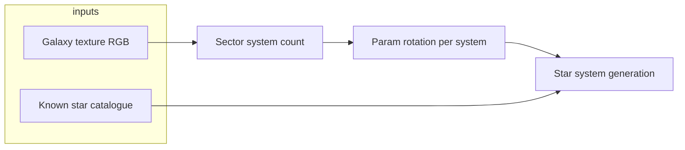

# GalaxyLib — Architecture

## Purpose

GalaxyLib is a C++17 library (CMake) that ports the procedural galaxy generation from the legacy **GalaxyE** C# project (`GalaxyE-master`). It is intended for use from a C++ game engine. A small console executable validates the port against the original behavior.

## Source of truth

- **Behavioral reference:** `GalaxyE-master/GalaxyE/Galaxy/*.cs`, especially `Sector.cs`, `Coords.cs`, `StarSystem.cs`, `Utils.cs`, `Base36.cs`, `KnownSpace.cs`.
- **Spatial model:** The galaxy is a square of **8191 × 8191 sectors** spanning **100 000 light years** per axis (`GalaxyConstants` in `Coords.cs`).
- **Sector identity:** Each sector is addressed by `(IndexX, IndexY)` with indices in `0 … 0x1FFF` (13 bits each). `SystemId` and `SectorId` pack these into `ulong` values as in the C# code.

## High-level data flow

1. **Milky Way texture** (`Galaxy.bin`): 128×128 (plus padding in the original layout) RGB data sampled to compute **how many star systems** exist in a sector (`Generate_NumSystems` in `Sector.cs`).
2. **Known space** (`KnownSpace`): real/catalogue stars mapped into sector coordinates; when present, they **replace** procedural systems for that sector.
3. **Procedural systems:** For each system index, two `ulong` parameters are advanced with `Utils.Rotate_SystemParams`, then passed into `StarSystem.Generate` (spectral class, position in sector, names, etc.).

## Module boundaries (C++)

| Area | Responsibility |
|------|------------------|
| `galaxy_api` | Game-facing facade: `initialize`, `library_version`, `SystemSummary`, `list_system_summaries` (extend here for stable API). |
| `star_date` | `StarDate` — `from_earth`, `from_earth_utc`, `s_date`, `to_string` (`StarDate.cs`). |
| `galaxy_constants` | Fixed numeric constants (sector size, grid size, local resolution). |
| `base36` | Encode/decode sector and coordinate strings (matches `Base36.cs`). |
| `coords` | `GalacticLocation`, `SectorLocation`, `Coords`, `SystemId` / `SectorId` (`Coords.cs`). |
| `known_space` | Real-star catalogue from `KnownSpace.cs` (`k_catalog` + `try_fill_known_systems`). |
| `galaxy_utils` | Bit rotations and PRNG mixing (`Utils.cs`). |
| `milky_way` / `galaxy_map` | Load and hold RGB galaxy texture; indexed like `TheMilkyWay[]` in C#. |
| `sector` | `Generate_NumSystems`, `get_system_params`, lazy `systems()` list. |
| `star_system` | Procedural `Generate` (spectral class, names, local x/y/z); tables in `star_system_tables.cpp` (generated). |
| `known_space` | Optional catalogue of named stars → sector occupancy (staged). |

## Assets

- **`assets/Galaxy.bin`:** Raw RGB triplets, same layout as produced by the C# `Sector` static constructor reading `Galaxy.bin`. In this repo it is generated from the embedded `TheMilkyWay2` byte table in `Sector.cs` (grayscale expanded to RGB) so builds work without the original GIF pipeline.

## Build layout

- **`galaxylib`:** Static (or shared) library, public headers under `include/galaxylib/`.
- **`galaxy_test`:** Console app linking `galaxylib`, loads `Galaxy.bin` from a configurable path (defaults to project `assets/` via CMake).

## Threading and determinism

- Generation is **deterministic** given sector indices and the same `Galaxy.bin` data: no `std::random_device` in core paths that mirror the C# port.
- If the library is later used from multiple threads, **immutable** galaxy map data after load and **read-only** sector generation are the intended model; mutable global state should be avoided (singleton replaced with injectable `GalaxyMap` when needed).

## Future integration (game)

- Expose a minimal C-style API or stable C++ ABI surface if crossing DLL boundaries.
- Keep rendering/UI out of this library; only math, IDs, and generation.
